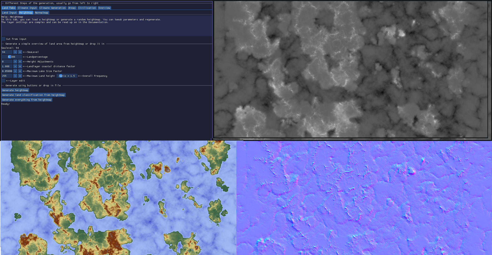
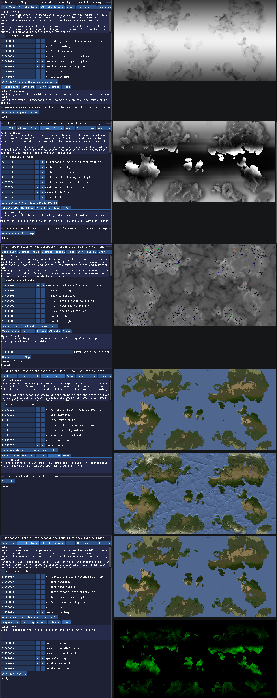
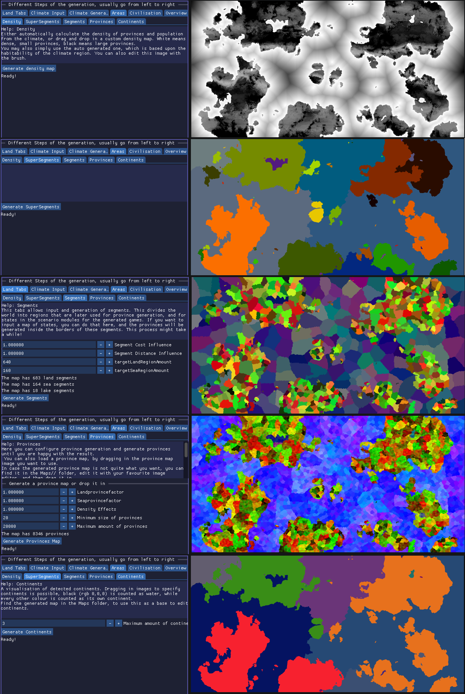
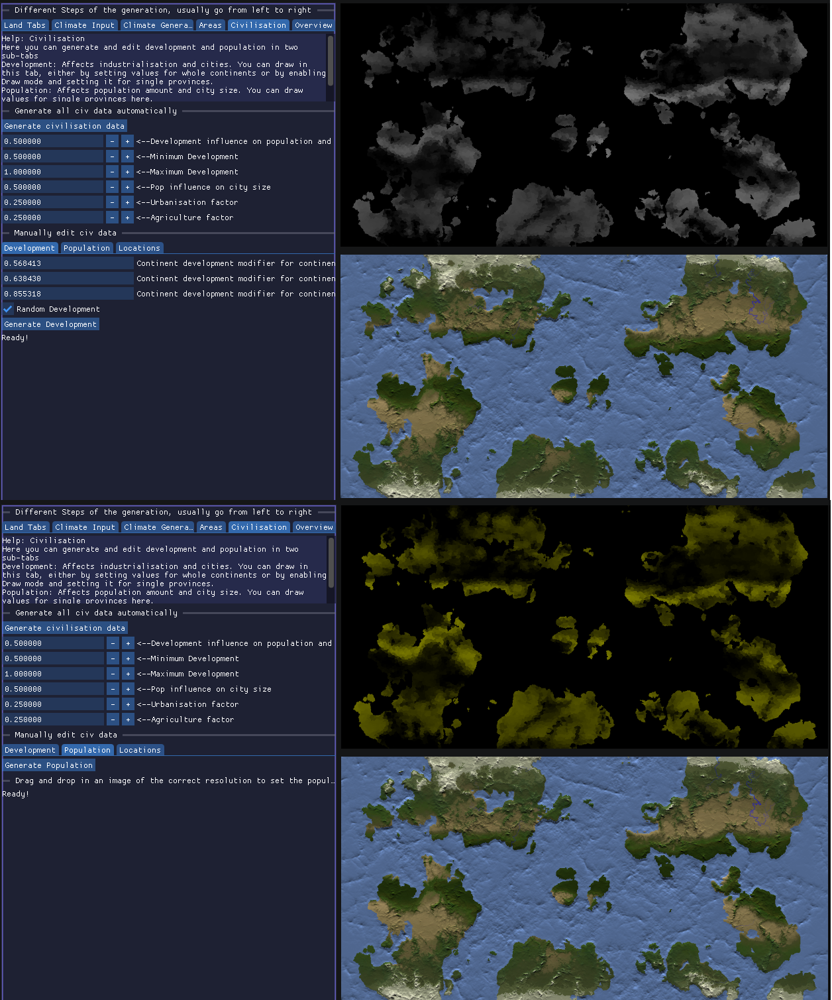
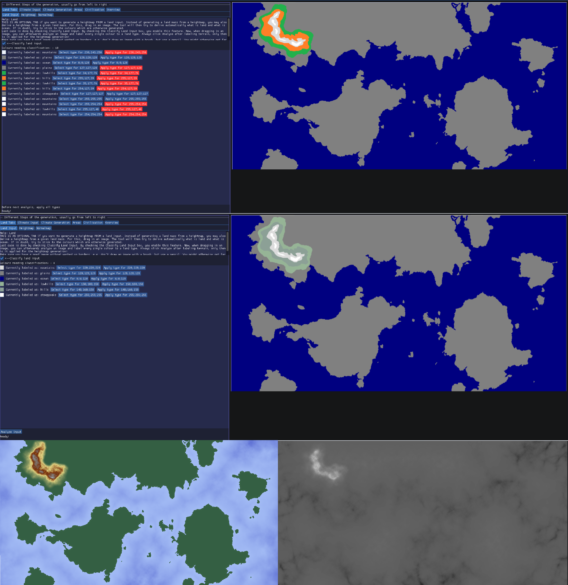
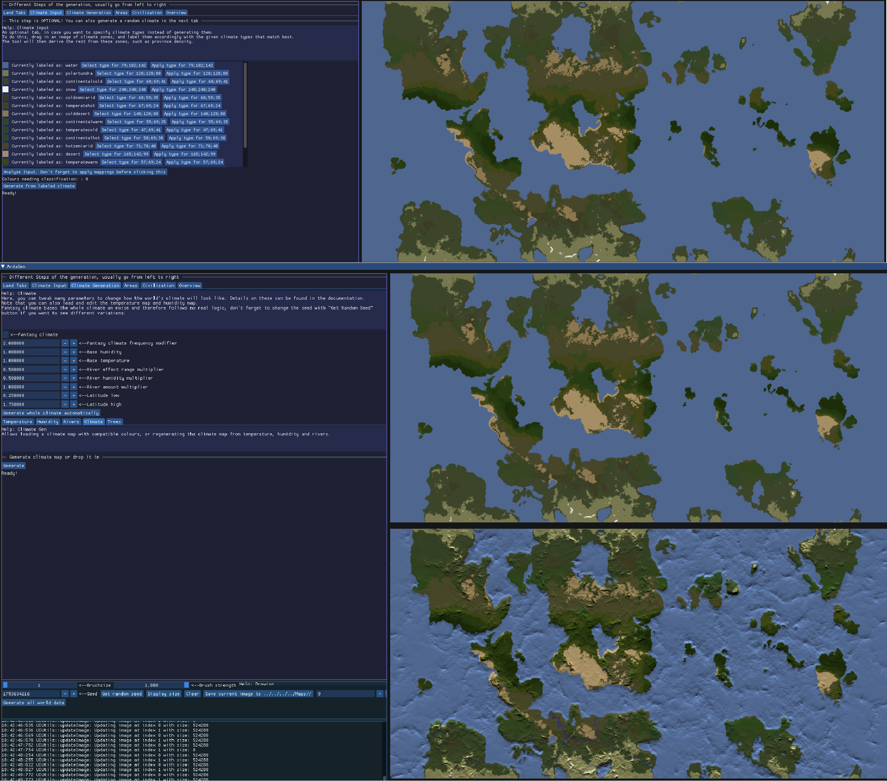
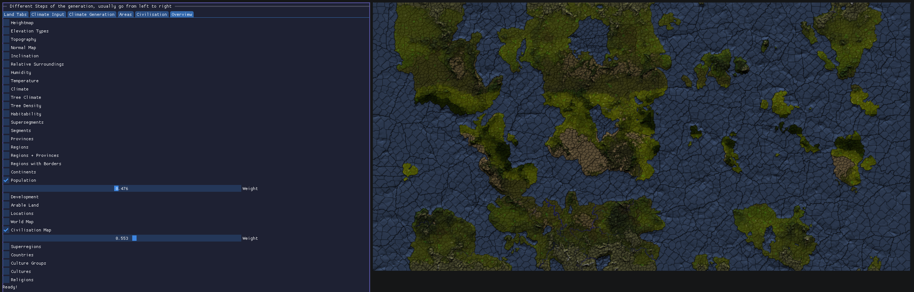

# ArdaGen Fantasy World Generator
A frontend for ArdaGenLib, a library for fantasy world generation, using terrain generated by FastWorldGen (not yet open source).
Bases many parts of the GUI off FastWorldGenGUI.

